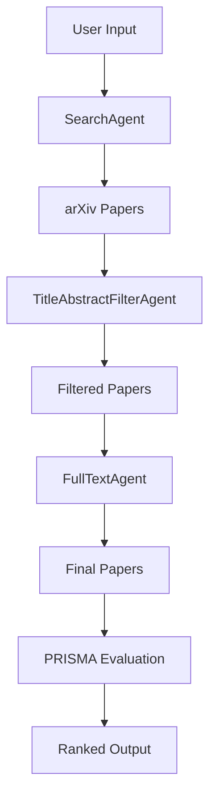

# PRISMA-MARL: Automated Systematic Literature Review with Multi-Agent Reinforcement Learning

## Project Overview
PRISMA-MARL is an automated system for conducting systematic literature reviews in compliance with the PRISMA 2020 guidelines. The system leverages a Multi-Agent Reinforcement Learning (MARL) framework with Deep Q-Networks (DQNs) to streamline the literature review process through three specialized agents that handle search, abstract screening, and full-text evaluation. The system includes a web interface for user interaction and produces ranked paper lists with PRISMA compliance scores.

## Key Features
- **Automated PRISMA-Compliant Reviews**: Implements the PRISMA 2020 methodology for systematic reviews
- **Multi-Agent RL Framework**: Three specialized agents working sequentially:
  - `SearchAgent`: Optimizes search queries for arXiv
  - `TitleAbstractFilterAgent`: Screens papers based on titles/abstracts
  - `FullTextAgent`: Evaluates full-text PDFs
- **Dynamic Reward System**: Combines relevance, diversity, ground truth matching, and PRISMA compliance
- **User-Friendly Interface**: Streamlit web app for training and inference
- **Reproducible Research**: Logging and model persistence

## System Architecture


## Installation
### Prerequisites
- Python 3.8+
- Operating System: Windows/Linux/macOS

### Setup
1. Clone the repository:
   ```bash
   git clone https://github.com/MOsama10/prisma-marl-review.git
   cd prisma-marl-review
   ```

2. Create and activate virtual environment:
   ```bash
   python -m venv venv
   source venv/bin/activate  # Linux/macOS
   venv\Scripts\activate    # Windows
   ```

3. Install dependencies:
   ```bash
   pip install -r requirements.txt
   ```

## Usage
### Training the Agents
```bash
python trainer/train_agents.py
```
Note: Pre-trained models are included in the `models/` directory.

### Running the Web Interface
```bash
streamlit run app.py
```
The interface allows:
- Training new models
- Conducting literature reviews with custom parameters
- Viewing and exporting results

### Command Line Interface
```bash
python main.py
```

## Project Structure
```
prisma_marl_project/
├── agents/
│   ├── search_agent.py
│   ├── title_abstract_filter.py
│   ├── full_text_agent.py
│   ├── prisma_checker.py
├── rewards/
│   ├── enhanced_reward_system.py
├── utils/
│   ├── arxiv_interface.py
│   ├── full_text_parser.py
│   ├── logger.py
├── trainer/
│   ├── train_agents.py
├── models/
│   ├── search_agent.pth
│   ├── abstract_agent.pth
│   ├── fulltext_agent.pth
├── app.py
├── main.py
├── PRISMA_2020_checklist.pdf
├── prisma.log
├── requirements.txt
├── README.md
```

## Components
### 1. Agents
- **SearchAgent**: Modifies search queries using DQN (state: 386D, actions: 5)
- **TitleAbstractFilterAgent**: Abstract screening (actions: Include/Maybe/Exclude)
- **FullTextAgent**: Final inclusion decisions

### 2. PRISMA Checker
- Validates review process against PRISMA 2020 checklist
- Computes compliance scores (0-1 scale)

### 3. Reward System
- Four-component reward:
  1. Relevance (cosine similarity)
  2. Diversity (1 - pairwise similarity)
  3. Ground truth matching
  4. PRISMA compliance

## Output
The system generates:
1. Ranked CSV of papers with metadata and scores
2. PRISMA compliance score (0-1)
3. Persistent models for future use

## Troubleshooting
Common issues:
- **Blank PRISMA Checklist**: Ensure `PRISMA_2020_checklist.pdf` exists in root directory
- **Training Failures**: Check internet connection for arXiv API access
- **Dependency Conflicts**: Use exact versions in requirements.txt


## Contact
For questions or contributions, please contact [M.Osaammaa@gmail.com] or open an issue in the repository.
